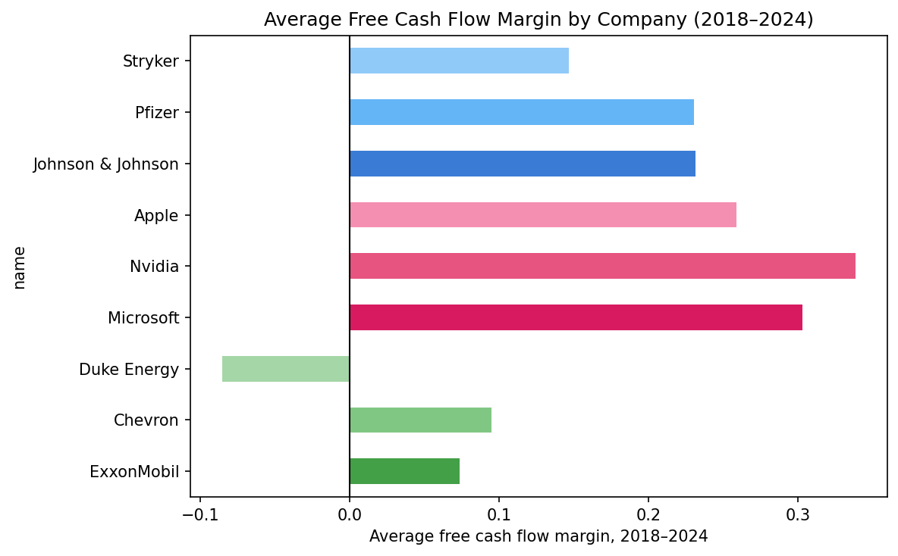
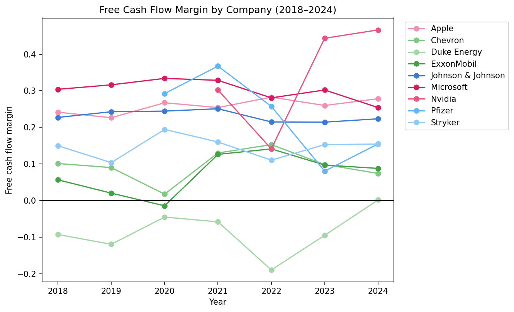
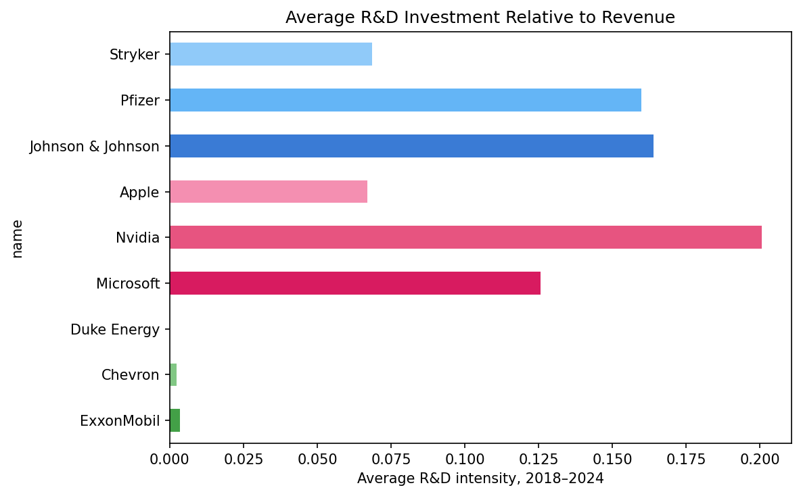
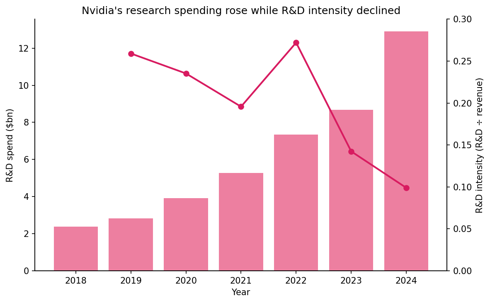

# How Do Companies Fund Growth? Comparing Technology, Healthcare, and Energy

Companies can grow in different ways: by investing in research and new products, using cash generated from operations, or investing in physical assets and infrastructure.

This analysis compares nine US companies across Technology, Healthcare, and Energy from 2018 to 2024. The results show that growth strategies depend not only on sector, but also on each company's business model.

## 1. The ability to fund growth depends more on the company than the sector

Technology companies often have strong cash generation, but this is not unique to the sector. Microsoft and Apple generate high free cash flow, allowing them to finance growth internally. However, Johnson & Johnson, a Healthcare company, shows similarly strong cash generation.

In contrast, Duke Energy has weaker free cash flow because utilities require large ongoing infrastructure investments. ExxonMobil and Chevron also show changes over time due to energy market cycles.

Overall, the ability to self-fund growth depends more on a company's business model than its sector.

## 2. Companies within the same sector can have very different strategies

Sector averages show that Technology and Healthcare companies generally invest more in R&D than Energy companies. However, large differences exist between companies within the same industry.

For example, Nvidia invests a much larger share of revenue in R&D than Apple, despite both being Technology companies. Similarly, Healthcare companies such as Johnson & Johnson, Pfizer, and Stryker maintain high R&D investment because innovation and product development are essential to their businesses.

This shows that sector classification provides a useful overview, but company strategy explains many of the differences in investment behaviour.

## 3. Higher R&D spending does not always mean higher R&D intensity

Nvidia demonstrates why both absolute spending and ratios are important.

Between 2018 and 2024, Nvidia's R&D spending increased significantly as the company expanded into AI and data-centre technologies. However, R&D intensity decreased because revenue grew even faster than R&D expenditure.

This means a company can invest more money into research while showing a lower R&D-to-revenue ratio. Looking at only one measure can therefore give an incomplete picture.

## Conclusion

The analysis shows that growth strategies are not determined only by sector. Some companies can finance growth through strong cash generation, while others require continuous investment in assets or research.

Sector comparisons are useful for identifying broad patterns, but company-specific strategies explain the biggest differences in how firms invest, generate cash, and grow.

*Full analysis and evidence: [NB03 – Data Analysis](../notebooks/NB03-silyzch-Data-Analysis.ipynb)*